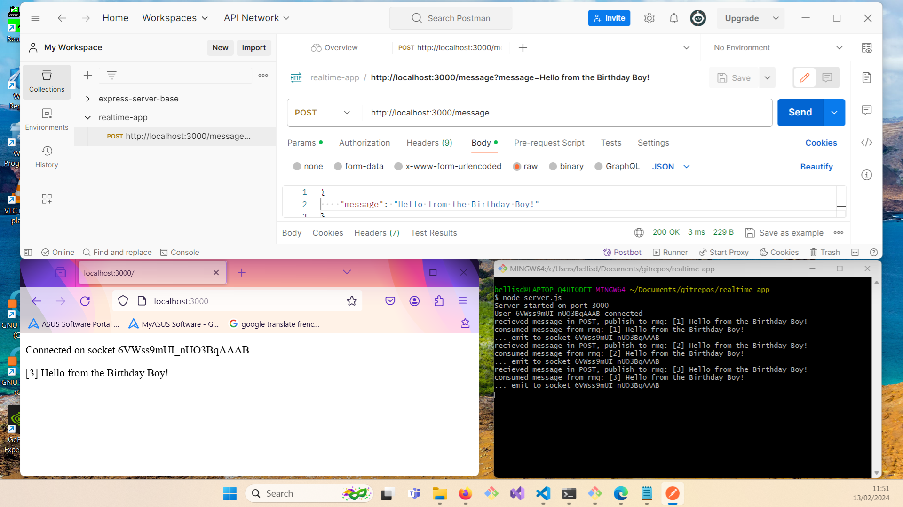

# Notify Browser Client

How can we notify a browser client that an event has occurred ?

1. NodeJS Express Server that accepts a POST request with a message in the body

2. The Server then publishes this message to a RabbitMQ message queue

3. The Server also has a subscription to this message queue so he then consumes the message and emits it through a SocketIO socket to the connected browser for display in the UI

## Tests

